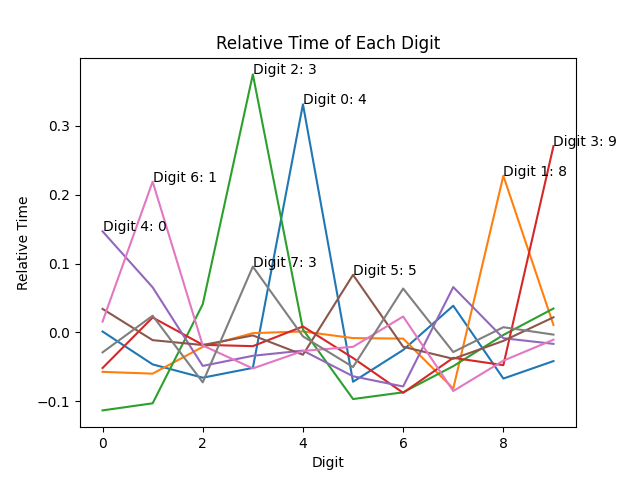

# Side Channel

I've been told not to try to reverse engineer the pin checker, or run forensics against it, but rather `timing-based side-channel attacks`.

If I had to bet, correct pin numbers will take more time for the pin checker to check, and as we have the binary we can run it ourselves.

I wrote a little script that attempts to determine the correct pin number by trying all the pins (one by one) and saving the digit that took the longest time. I imagine that the system takes digits from left to right, and stops when it encounters an incorrect digit.

When I ran it the first time, the pin number I got was `40084091`, but that was not correct. So I decided to implement a "multiple run" system, where it would run the same pin multiple times, to help eliminate noise.

The second time I ran it I got `48390513`, which is the correct pin!

Sticking this into the master server we get the flag: `picoCTF{t1m1ng_4tt4ck_eb4d7efb}`.

I thought that this challenge was pretty neat, and I learned how to do something new. I also collected the time information (now in `data.py`) and created some graphs that show how "significant" the difference in time was.

Here's the image:

As you can see the numbers that were the correct digits are easily seen when compared to the rest of the digits in the same run. Digit 5 was the least significant, but I assume that more runs would have led to greater significance.
